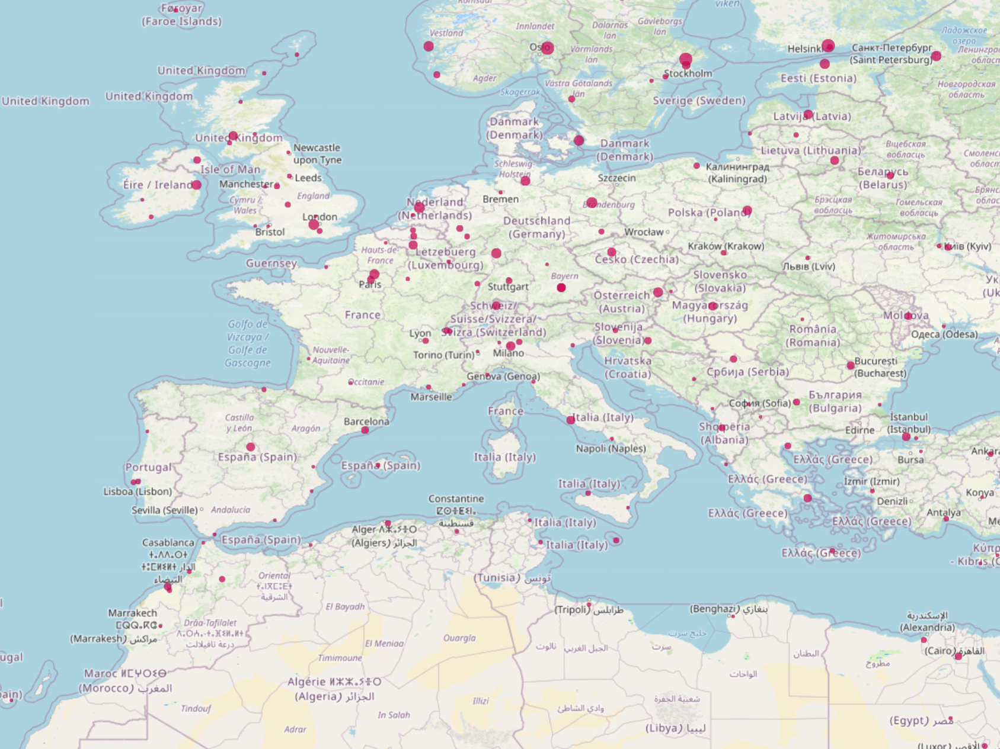

# deck.gl with EPSG:4326


I used to work on making MapboxJS and deck.gl support EPSG:4326 projection, so I share my code in this repo. 

About how to make mapbox supports EPSG:4326 projection, you can refer to this repo,

https://github.com/cgcs2000/mapbox-gl-js

This file `./examples/get-started/pure-js/mapbox/mapbox-gl.js`, is compiled from this repo.

By the way, cgcs2000 is similar to wgs84, you can treat them as same thing when talking about map projection.

Enter `./examples/get-started/pure-js/mapbox/` folder, and run webpack server, you will get a map like this picture.



Currently, you should only use this deck.gl with mapbox, and deck.gl should be added to mapbox as a layer.

Because deck.gl will not work properly with mouse drag and wheel zoom.

If you want to use this code in your production, you still have some other work to do.

## some detail

I notice the calculation about map projection is processed by `math.gl`, so I copied all `math.gl` into this repo and made some change.

For example:

```javascript
// Unproject world point [x,y] on map onto {lat, lon} on sphere
export function worldToLngLat([x, y], srs) {
  const lambda2 = (x / TILE_SIZE) * (2 * PI) - PI;
  let phi2;
  if (srs === SRS.EPSG3857) {
    phi2 = 2 * (Math.atan(Math.exp((y / TILE_SIZE) * (2 * PI) - PI)) - PI_4);
  } else {
    phi2 = PI / 2 - 2 * PI * (1 - y / TILE_SIZE);
  }
  return [lambda2 * RADIANS_TO_DEGREES, phi2 * RADIANS_TO_DEGREES];
}
```


